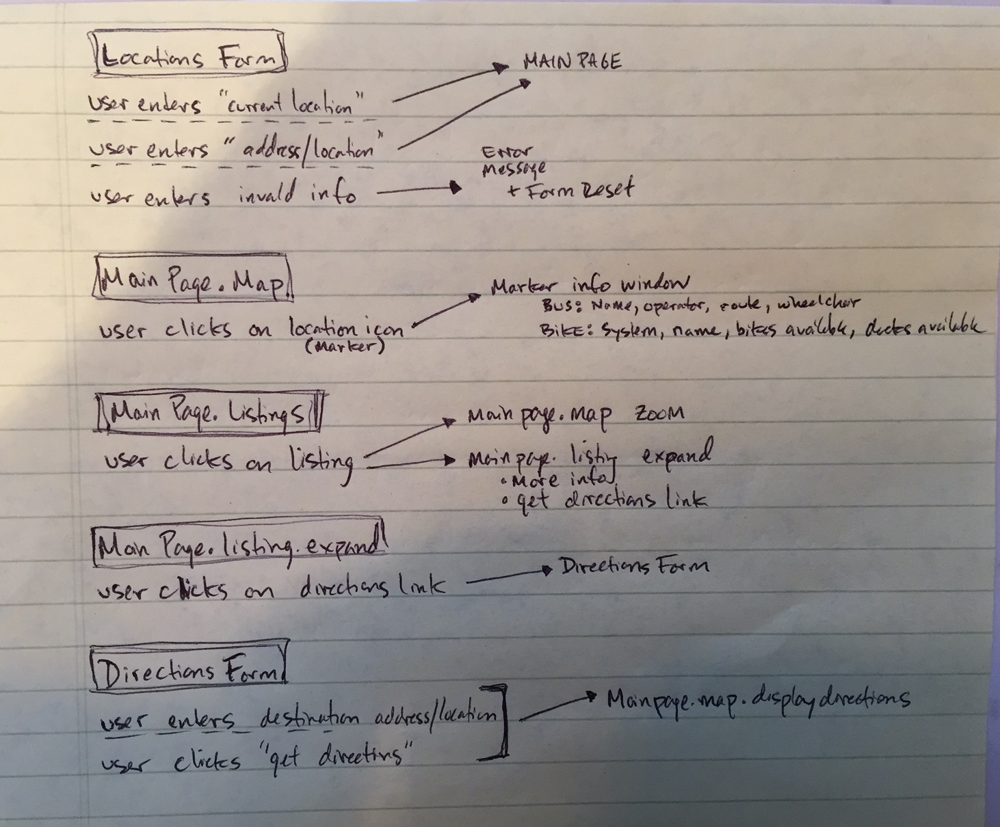
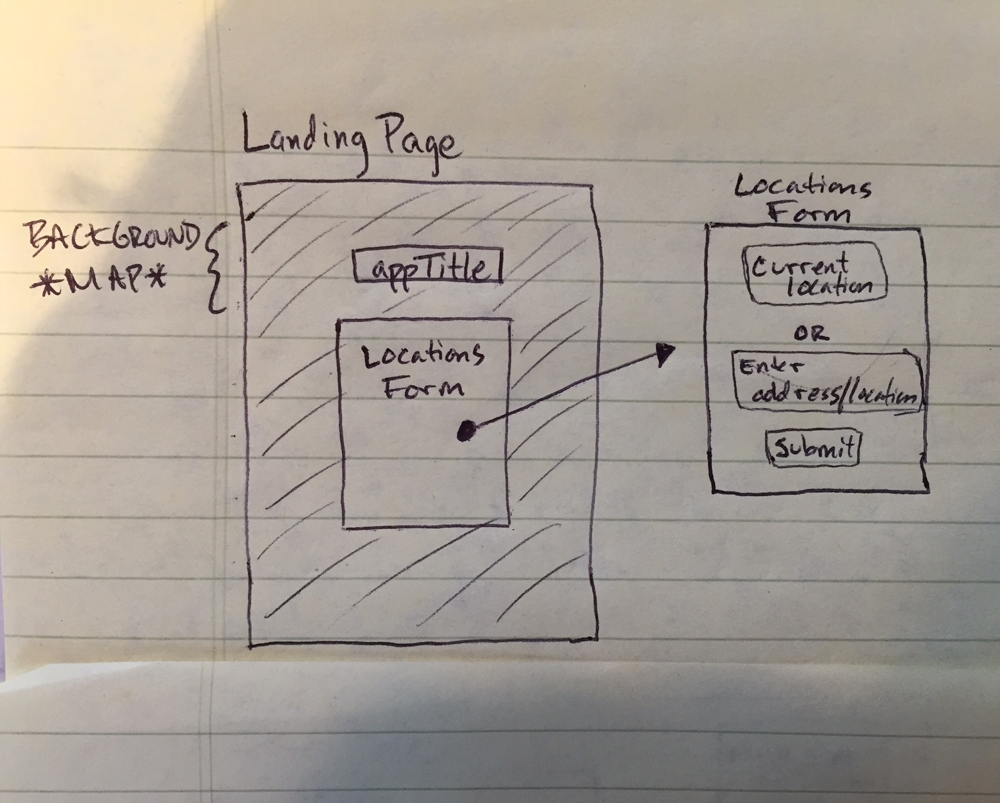
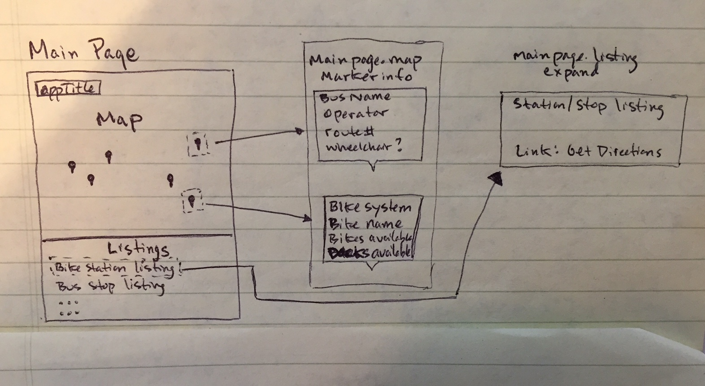
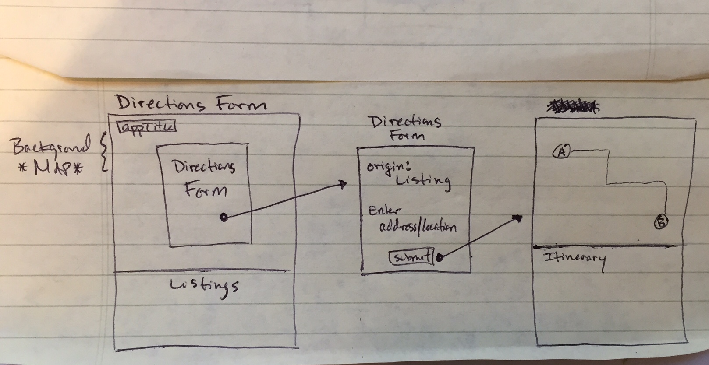

# City • Mode | Thinkful API Capstone
## Project Description
This app provides a user the ability to quickly locate the nearest bikeshare stations and bustops around their current location.  They can also search for a specific address or landmark to see these transportation modes too.  Selecting a Marker Icon or Selection in the Listings tab will provide more information on the selected mode.

Along with Mapbox, this app uses two API's:  Transitland and Coord
* [Mapbox](https://www.mapbox.com/ "Mapbox Homepage")
* [Transitland](https://transit.land/ "Transitland Homepage")
* [Coord](https://coord.co/ "Coord Homepage")

### [*** Live Preview ***](https://mattcoppola.github.io/transportation-search-api-capstone/)

## User Stories
* As a user I want to load the app and show my current location
* As a user I want to also be able to enter a different location to find the nearest bike stations and bus stops
* As a user I want to see the nearest bike stations and bus stops as the app loads my location
* As a user I want to click on a map marker to display more information about the stop/station
* [Future Feature - see Road Map] As a user I want to be able to select my mode of transportation and search for my destination to receive travel itinerary

**User Flows Sketch**

## Wire Frames
**Landing Page**

As a user I want to load the app and show my current location

As a user I want to also be able to enter a different location to find the nearest bike stations and bus stops

**Main Page**

As a user I want to see the nearest bike stations and bus stops as the app loads my location

As a user I want to click on a map marker to display more information about the stop/station

**Directions Form**

As a user I want to be able to select my mode of transportation and search for my destination to receive travel itinerary

## Technical
#### Front End
* HTML5
* CSS3
* JavaScript
* jQuery

#### Responsive
This app is designed to be responsive to smaller screens using media queries

## Development Road Map
Features for future updates include:
* Ability to obtain directions by selecting the listing's 'Get Directions' link
* Clicking on a Map Marker will expand the selection on the Findings section
* Add filter to only return one mode of transportation
* Add additional modes of transportation (Rail, Boat, Air)
